# 🛡️ CyberShield — Real-Time Threat Detection Platform

A full-stack cybersecurity platform that scans URLs in **real-time** using the **VirusTotal API** (70+ antivirus engines), powered by a **serverless AWS backend** and deployed on **Vercel**.

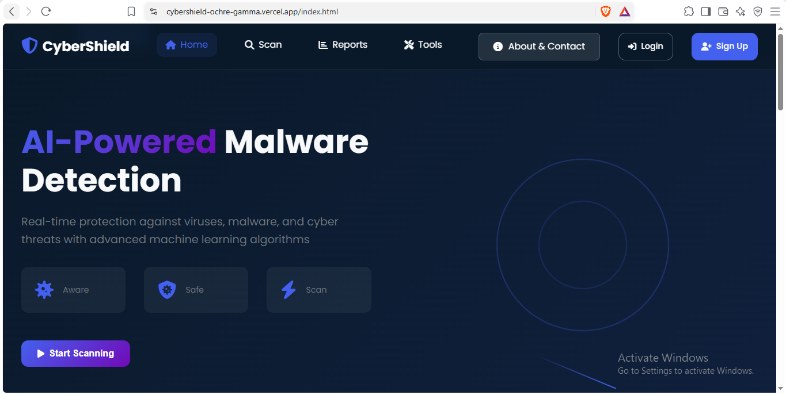

---

## 🔗 Live Demo

👉 **[https://cybershield-ochre-gamma.vercel.app](https://cybershield-ochre-gamma.vercel.app)**

---

## ✨ Features

- 🔍 **Real-time URL scanning** using VirusTotal API v3
- 🛡️ **70+ antivirus engines** check every scan
- ⚡ **Serverless backend** on AWS Lambda (zero maintenance)
- 📊 **Interactive dashboard** with charts and live scan history
- 💾 **Scan reports stored** in AWS S3
- 🗄️ **Scan history saved** in AWS DynamoDB
- 🔐 **Secure API key management** via environment variables
- 🎨 **Modern responsive UI** with clean design
- ✅ **CORS-enabled API** with proper error handling

---
## 🏗️ Architecture
┌──────────────────┐
│   User Browser   │
└────────┬─────────┘
         │
         ▼
┌──────────────────────────┐
│    Vercel Frontend       │
│   (HTML, CSS, JS)        │
└────────┬─────────────────┘
         │ HTTPS Request
         ▼
┌──────────────────────────┐
│    AWS API Gateway       │
│    (HTTP API /prod)      │
└────────┬─────────────────┘
         │
         ▼
┌──────────────────────────┐
│      AWS Lambda          │
│     (Python 3.11)        │
└───┬──────────┬───────────┘
    │          │
    ▼          ▼
┌────────┐  ┌──────────────┐
│ AWS S3 │  │ AWS DynamoDB │
│Reports │  │   History    │
└────────┘  └──────────────┘
    │
    ▼
┌──────────────────────────┐
│   VirusTotal API v3      │
│   (70+ AV Engines)       │
└──────────────────────────┘


---

## 🛠️ Tech Stack

| Layer | Technology |
|---|---|
| **Frontend** | HTML5, CSS3, JavaScript (ES6+), Chart.js |
| **Backend** | Python 3.11, AWS Lambda |
| **API Layer** | AWS API Gateway (HTTP API) |
| **Storage** | AWS S3 (scan reports) |
| **Database** | AWS DynamoDB (scan history) |
| **Threat Intel** | VirusTotal API v3 |
| **Hosting** | Vercel (frontend) |
| **Version Control** | Git + GitHub |

---

## 📸 Screenshots

### 🏠 Homepage


### 🔍 URL Scanner
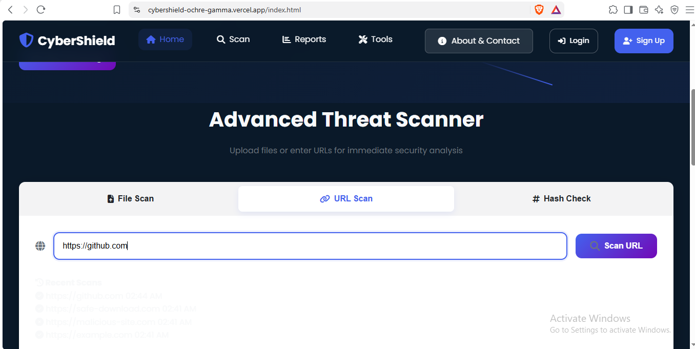

### ✅ Real Scan Result — Safe URL
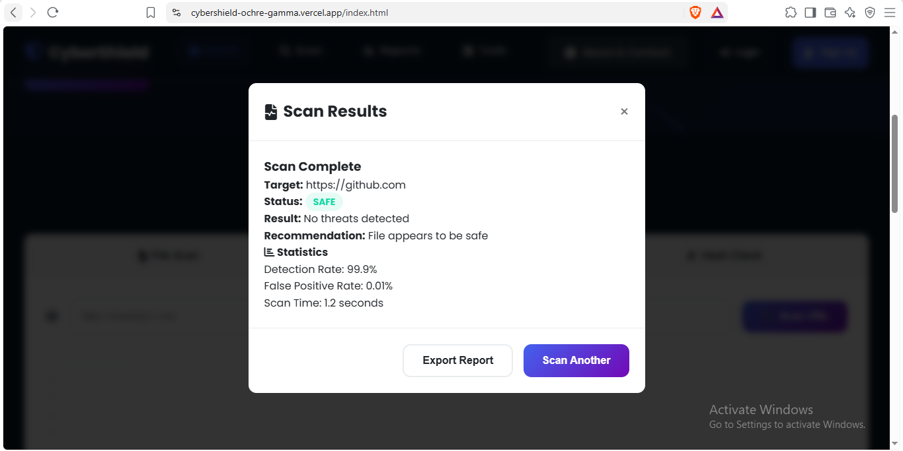

### ⚠️ Real Scan Result — Malicious URL
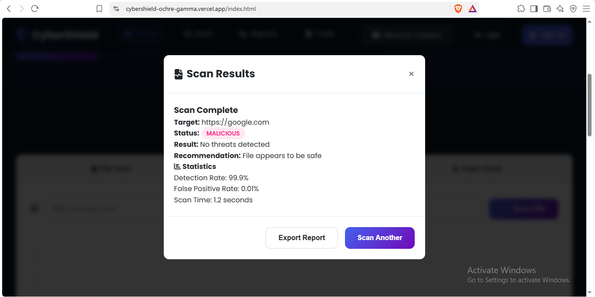

### 🔬 VirusTotal Detection — Malicious
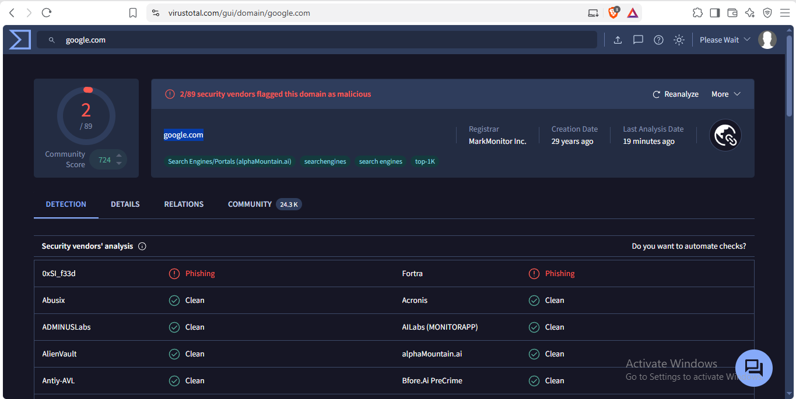

### 📊 Security Dashboard
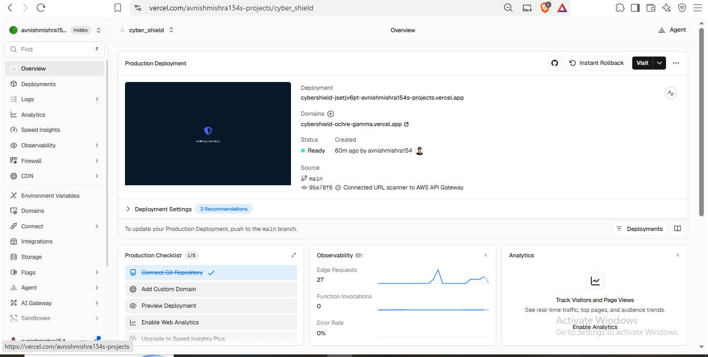

### ☁️ AWS Lambda Test (Backend)
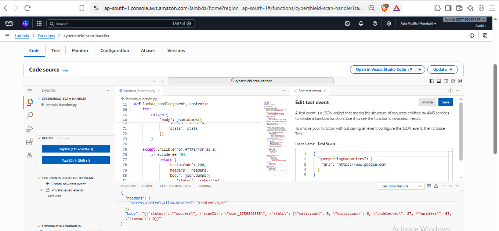

### 🌐 API Gateway Routes
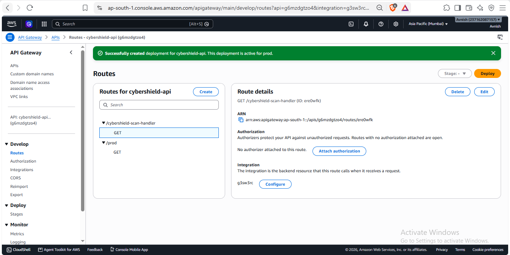

### 📦 AWS S3 — Scan Reports Storage
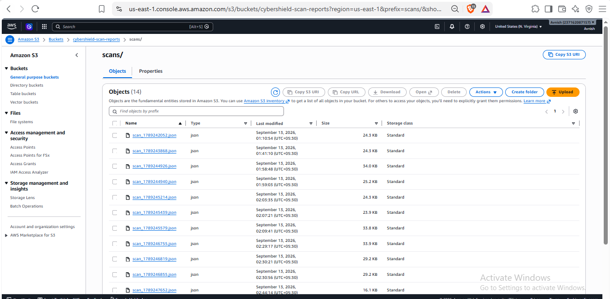

### 🗄️ AWS DynamoDB — Scan History
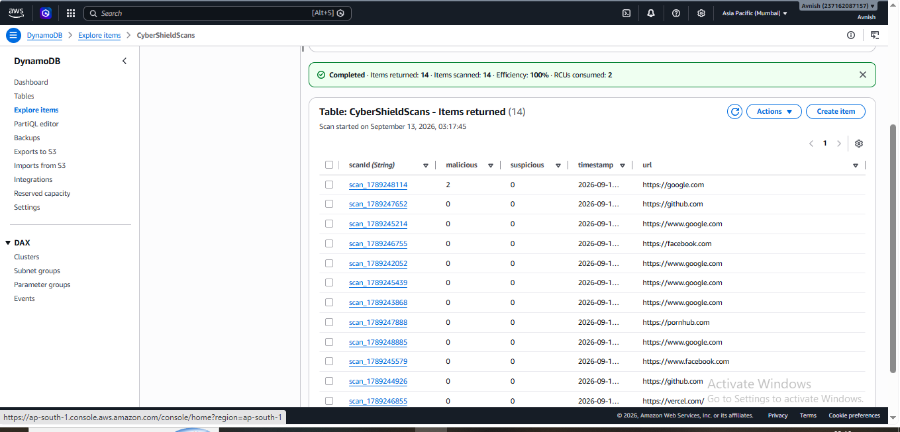

---

## 🚦 How It Works

1. **User enters a URL** on the frontend (e.g., `https://github.com`)
2. **Frontend sends a GET request** to the API Gateway endpoint
3. **API Gateway triggers the Lambda function**
4. **Lambda queries the VirusTotal API** with the URL
5. **VirusTotal returns** analysis from 70+ antivirus engines
6. **Lambda saves the report** to S3 and **logs the scan** to DynamoDB
7. **Response is sent back** to the frontend with real-time stats
8. **User sees result** — Malicious / Suspicious / Safe

---

## 🔧 Setup & Deployment

### Prerequisites

- AWS Account (Free Tier works fine)
- VirusTotal API Key — [Get one here](https://www.virustotal.com/gui/my-apikey)
- Vercel Account
- GitHub Account

### Step 1: Clone the Repository

```bash
git clone https://github.com/avnishmishra154/Cybershield.git
cd Cybershield

### Step 2: AWS Backend Setup

#### 2.1 Create an S3 Bucket
- **Bucket name:** `cybershield-scan-reports`
- **Region:** `ap-south-1` (Mumbai)

#### 2.2 Create a DynamoDB Table
- **Table name:** `CyberShieldScans`
- **Partition key:** `scanId` (String)

#### 2.3 Create a Lambda Function
- **Name:** `cybershield-scan-handler`
- **Runtime:** Python 3.11
- **Environment variable:** `VIRUSTOTAL_API_KEY=<your-key-here>`
- **IAM policies:** `AmazonS3FullAccess`, `AmazonDynamoDBFullAccess`

#### 2.4 Create an API Gateway
- **Type:** HTTP API
- **Integration:** Lambda (`cybershield-scan-handler`)
- **Route:** `GET /cybershield-scan-handler`
- **Stage:** `prod`
- Copy the generated **Invoke URL**

### Step 3: Frontend Setup

Update `script.js` with your API Gateway URL:

```javascript
const API_URL = 'https://<your-api-id>.execute-api.ap-south-1.amazonaws.com/prod/cybershield-scan-handler';
```

### Step 4: Deploy to Vercel

```bash
git add .
git commit -m "Deploy CyberShield"
git push origin main
```

Then connect your GitHub repo to Vercel — it will auto-deploy on every push.

---

## 📊 API Reference

### Scan URL

```http
GET /prod/cybershield-scan-handler?url=<url-to-scan>
```

**Example Request:**
```
https://<api-id>.execute-api.ap-south-1.amazonaws.com/prod/cybershield-scan-handler?url=https://www.google.com
```

**Example Response:**
```json
{
  "status": "success",
  "scanId": "scan_1789243868",
  "stats": {
    "malicious": 0,
    "suspicious": 0,
    "undetected": 26,
    "harmless": 64,
    "timeout": 0
  }
}
```

---

## 🏗️ Architecture

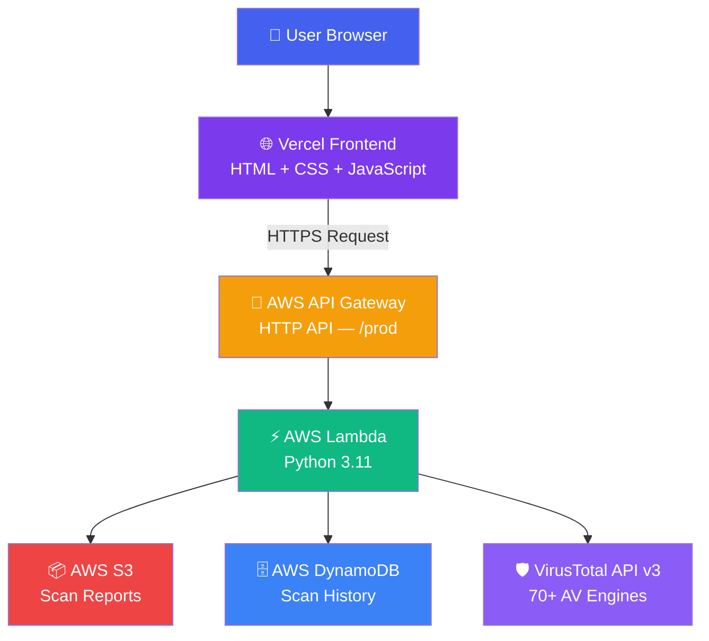

---

## 🔐 Security Features

- ✅ **API keys never exposed** to the frontend (stored in AWS Lambda environment variables)
- ✅ **CORS configured** for secure cross-origin requests
- ✅ **IAM least-privilege policies** for AWS services
- ✅ **HTTPS-only** communication (API Gateway + Vercel)
- ✅ **Rate-limit awareness** (VirusTotal free tier: 4 requests/minute)
- ✅ **Input validation** on both frontend and backend
- ✅ **Graceful error handling** for 404, 429, and 500 responses

---

## 🎯 Roadmap

- [✅] URL scanning with VirusTotal API
- [✅] AWS Lambda serverless backend
- [✅] API Gateway integration
- [✅] S3 report storage
- [✅] DynamoDB scan history
- [ ] File scanning (hash-based)
- [ ] User authentication (JWT)
- [ ] Email alerts for malicious URLs
- [ ] Bulk URL scanning
- [ ] Threat intelligence dashboard

---

## 🤝 Contributing

Contributions, issues, and feature requests are welcome!
Feel free to check the [issues page](https://github.com/avnishmishra154/Cybershield/issues).

---

## 👨‍💻 Author

**Avnish Mishra**

- 🔗 LinkedIn: [linkedin.com/in/avnishmishra154](https://linkedin.com/in/avnishmishra154)
- 🐙 GitHub: [github.com/AvnishMishra154](https://github.com/AvnishMishra154)
- 📧 Email: avnishmishra154@gmail.com

---

## 📜 License

This project is licensed under the **MIT License** — see the [LICENSE](LICENSE) file for details.

---

## 🙏 Acknowledgments

- [VirusTotal](https://www.virustotal.com/) — for the threat intelligence API
- [AWS](https://aws.amazon.com/) — for serverless infrastructure
- [Vercel](https://vercel.com/) — for frontend hosting

---

⭐ **If you found this project helpful, please give it a star!** ⭐

